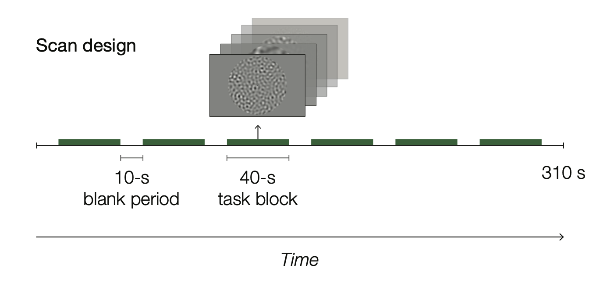
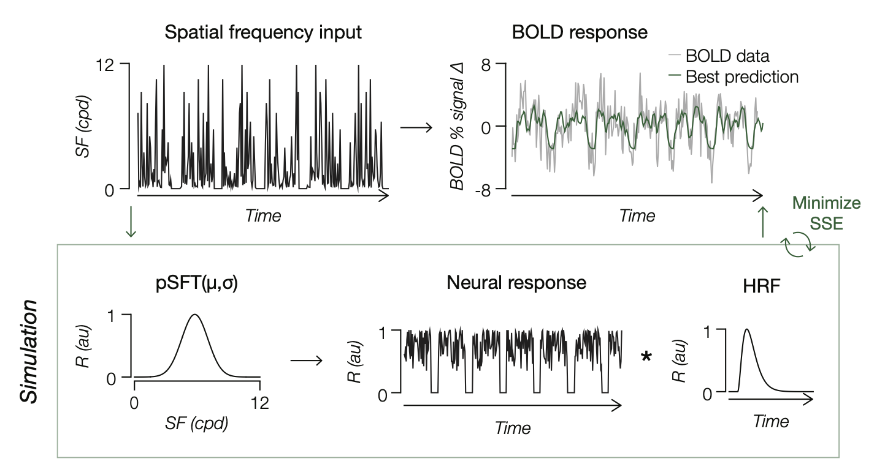
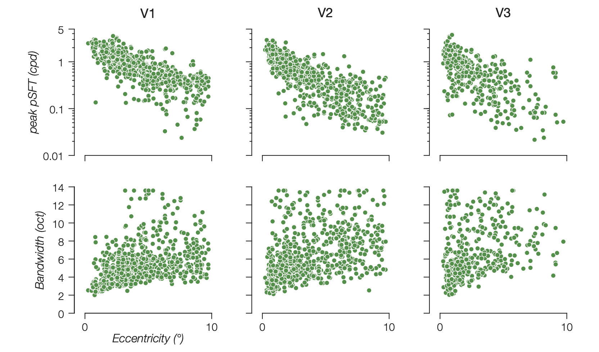

# Summary

A core goal of vision science is to develop computational models that characterize the fundamental response properties of neurons in visual cortex. One such property is spatial frequency (SF) tuning: neural populations in early visual cortex selectively respond to specific SFs, which determines the level of detail, coarse or fine, represented from the visual input. The ability to identify the SFs a neural population is tuned to reveals the spatial resolution of the information it encodes. Here, we present a toolbox for the efficient acquisition and estimation of population SF tuning (pSFT), enabling voxel-wise characterization of SF tuning from functional magnetic resonance imaging (fMRI) data.  

# Statement of need

 The `pSF-Toolbox` is a MATLAB package designed for the acquisition and voxel-wise estimation of population spatial frequency tuning (pSFT) from fMRI data. Variants of this approach have already been applied across multiple investigations, including studies on selective attention [@Ramirez:2025], amblyopia [@Wiecek:2024], and arousal [@Ramirez:2024], following its initial development [@Aghajari:2020]. Despite its demonstrated utility in characterizing a fundamental dimension of visual processing, no standardized or openly available implementation currently exists. By open-sourcing this toolbox, we aim to provide a streamlined, accessible solution that can facilitate reproducibility and complement future vision research on spatial frequency processing and beyond.

# Mathematics

We assumed that BOLD responses to spatial frequencies, $R(f)$, can be characterized by a logarithmic Gaussian distribution expressed as:

$$R([f(t)]) = e^{[log(f(t))-log(\mu)]^2\over 2\sigma^2}$$ 

where $f(t)$ is the spatial frequency (SF) presented at time $t$, $\mu$ is the SF that produces the maximum response of the population (the “pSFT peak”), and $\sigma$ is the tuning bandwidth, defining the population's selectivity around its preferred SF.

Because stimuli are not presented during blank periods between stimulus blocks (see \autoref{fig:experiment}), the SF input during these periods should be a small non-zero value (e.g., 0.0001) to avoid taking the logarithm of zero.

The population response to a sequence of SFs, $R[f(t)]$, is then convolved with a hemodynamic impulse response function, $h(t)$, to generate a predicted BOLD signal, $B(t)$ (see \autoref{fig:pipeline}):

$$B(t) = B \cdot R[f(t)] * h(t) + B_0$$ 

where $B$ and $B_0$ represent the scaling coefficient and baseline for the BOLD percent signal change, respectively. 

The hemodynamic impulse response function (HIRF), $h(t)$ , is a gamma function of the form:

$$h(t) = {(t/\tau)^{n-1}e^{-t/\tau}\over\tau(n-1)!}$$

where $\tau$ is the time constant (fixed to 1.08), $n$ is the phase delay (fixed to 3), and $t$ the delay between stimulus onset and the BOLD response (fixed to 2.05) [@Boynton:1996].

$\mu$, $\sigma$, $B$, and $B_0$ are the main parameters optimized per voxel by minimizing the sum of squared errors via non-linear least-squares optimization with parameter constraints (i.e., via `fmincon`).

# Workflow

**Requirements:**

- Psychtoolbox-3 must be installed for stimulus presentation [@Brainard:1997].
- The Optimization Toolbox for MATLAB must be installed for parameter optimization [@MATLAB].
- The shape of the BOLD percent signal change time series data must have time along the first dimension and voxels along the second (i.e., time x voxels).
- **Strongly recommended**: The Parallel Computing Toolbox for MATLAB must be installed for parallelization [@MATLAB].

The pSF-Toolbox streamlines the population spatial frequency tuning (pSFT) approach, originally developed by Aghajari, Vinke, & Ling 2020. 

This toolbox contains a suite of scripts for (A) stimulus presentation via Psychtoolbox to measure pSFT with fMRI (see `/measure-pSFT`) and (B) voxel-wise parameter optimization (see `/estimate-pSFT`). 

For more details, see the readme, but below we provide a high level overview. 

## Measuring pSFT

We provide a scan session template script for data acquisition (see `/measure-pSFT/run_session.m`). This script should be modified to support the experimental setup (e.g., screen parameters). 

The script loops through a set number of scan runs, 9 by default — enough to fit within an hour of scanning. In each run, there are 6 stimulus blocks each surrounded by blank periods (see \autoref{fig:experiment} and @Aghajari:2020). In short, within each stimulus block, spatial frequency-bandpass-filtered stimuli are presented in a random order. 

At central fixation, the dot will randomly increase in luminance. Participants should be instructed to maintain fixation and press a button when they detect a change in luminance at fixation. 

Run information is compiled into a structure, `run_info`, that should be saved. While already in `run_info`, the matrix containing the SF input time series for every block is stored as a separate `.mat` file for convenience, as the time series across multiple blocks and runs should be concatenated as an input vector (i.e., time x 1) into the pSFT optimization pipeline. 

## Estimating pSFT

For estimating pSFT parameters from fMRI data, `estimatePSFT` is the main high-level function, which then calls `fitVoxels` for voxel-wise parameter optimization. 

We include an example workflow for estimating pSFT from `sample_data.mat`, a structure array that contains concatenated SF input and measured BOLD time series across 9 scan runs from two subjects — 100 voxels in V1, V2, and V3 (see `/estimate-pSFT/example_pipeline.m`). 

`estimatePSFT` takes as input the stimulus spatial frequency time series, the measured BOLD time series in percent signal change, and a hemodynamic impulse response function (HIRF) to return a structure array  `pSFT` containing:

- estimated pSFT parameters ($\mu$, $\sigma$, $\beta$, $\beta_0$)
- estimated tuning curves
- estimated neural time series
- estimated BOLD time series
- $R^2$ values
- SSE values
- `fmincon` exit flags
- measured BOLD time series

### Intersection with the population receptive field

Population spatial frequency tuning (pSFT), when analyzed in conjunction with population receptive field (pRF) estimates (@Wandell:2007; @Dumoulin:2008), replicates a well-established relationship between pRF eccentricity, pSFT peak, and tuning bandwidth (@Aghajari:2020). Specifically, voxel-wise estimates show that spatial frequency preference decreases and tuning bandwidth increases with eccentricity and along the visual hierarchy (see \autoref{fig:estimates}).

# Figures

# Acknowledgements

We thank Sara Aghajari and Louis Vinke for providing the framework that this toolbox was based on. The development of this toolbox was supported by funding from the National Institutes of Health Grant EY028163 to S. Ling and supported by F99NS124144 to L.D. Ramirez. L.D. The sample BOLD data was acquired at the Boston University Cognitive Neuroimaging Center and involved the use of instrumentation supported by the NSF Major Research Instrumentation grant BCS-1625552. We acknowledge the University of Minnesota Center for Magnetic Resonance Research for use of the multiband-EPI pulse sequences. 

# References

